StarGAN with CelebA dataset
=============

## Model
> [Download (Kaggle)](https://www.kaggle.com/kimjiyeop/stargan-model)
### Generator:  
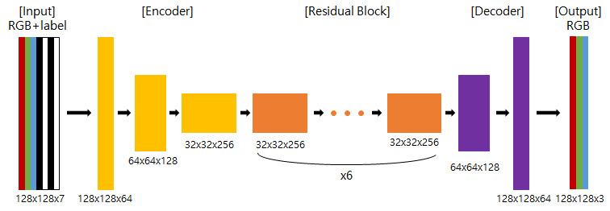  
  
### Discriminator:  
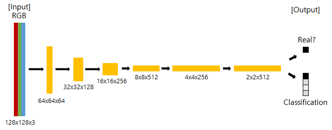  

### Gan Loss:  
> WGAN-GP
  
------------------
## Output Images  
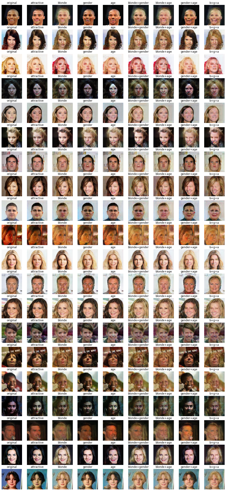  

------------------
## Loss  
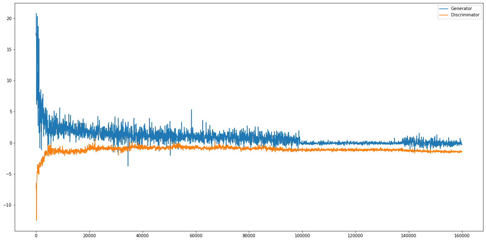  

------------------
## Change an image linealy  
> Change hair color, gender, and age  
  
  
> Change hair color, gender, and age in order  
  
  
> Change several images
  

------------------
## Change a gif file not in celeba dataset  
> Female Elon Musk  
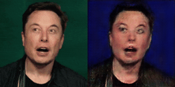  
  
> IU with blond hair  
  
  
------------------
## Change only one character (blonde / gender / age)  
### Blonde → not blonde  
  
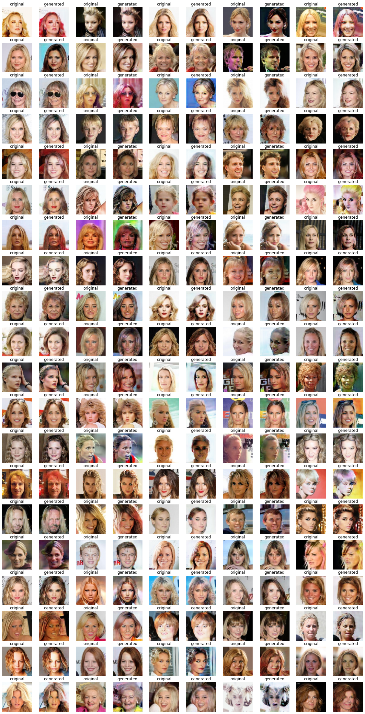  
### Not blonde → Blonde  
  
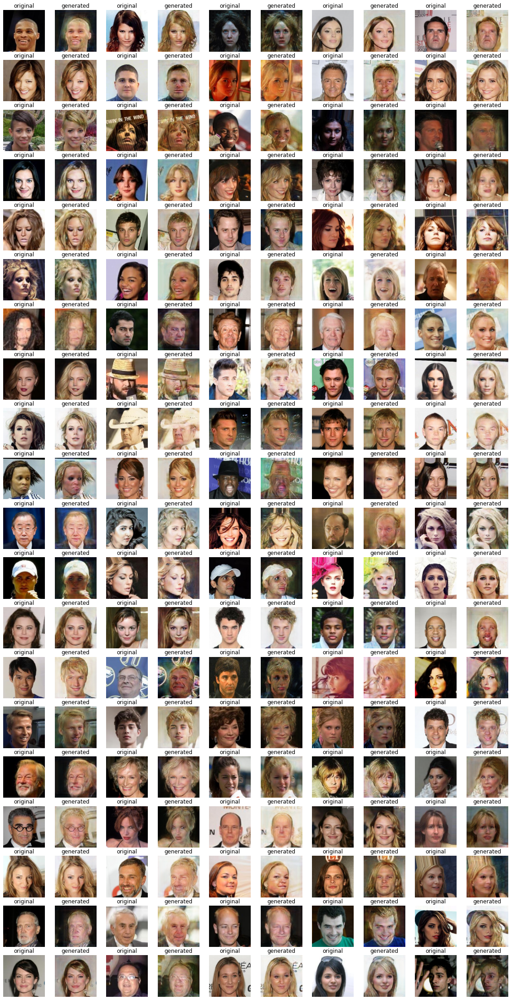  
### Male → Female  
  
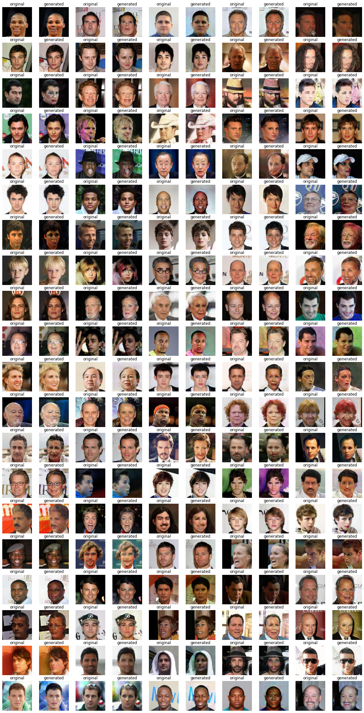  
### Female → Male  
  
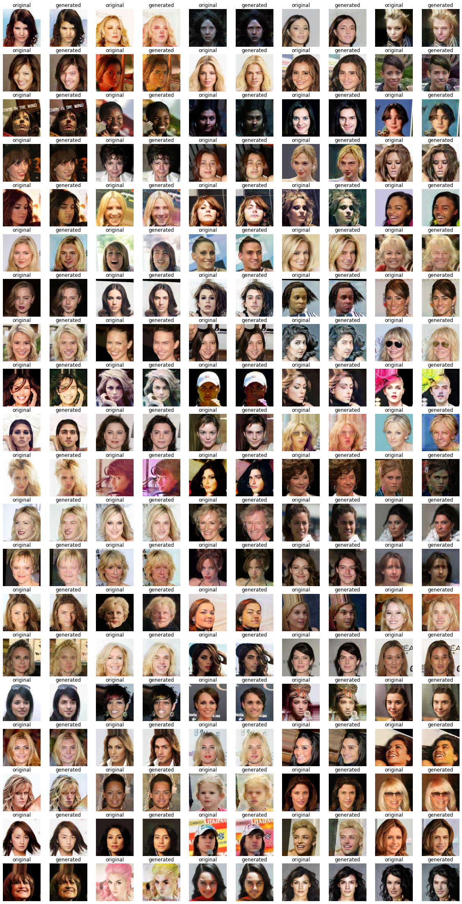  
### Young → Old  
  
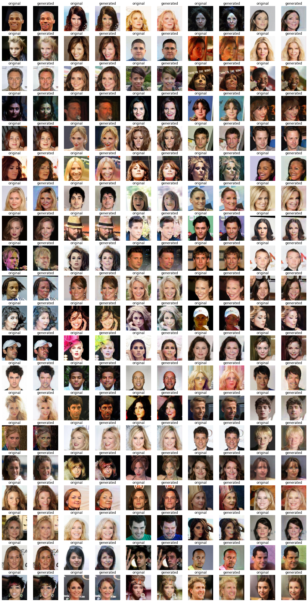  
### Old → Young  
  
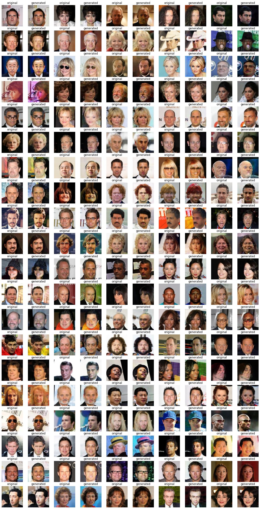  
