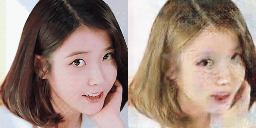

StarGAN with CelebA dataset
=============

  

## Model
> [Download (Kaggle)](https://www.kaggle.com/kimjiyeop/stargan-model)
### Generator:  

  
  
### Discriminator:  

  

### Gan Loss:  
> WGAN-GP

   

## Output Images  

  

## Loss  

  

   

## Change an image linealy  
> Change hair color, gender, and age  

  
  
> Change hair color, gender, and age in order  

  

   

## Change a gif file not in celeba dataset  
> Female Elon Musk  

  
  
> IU with blond hair  

  
  
   

## Change only one character (blonde / gender / age)  
### Blonde → not blonde  
  

  

### Not blonde → Blonde  
  

  

### Male → Female  
  

  

### Female → Male  
  

  

### Young → Old  
  

  

### Old → Young  
  

  
